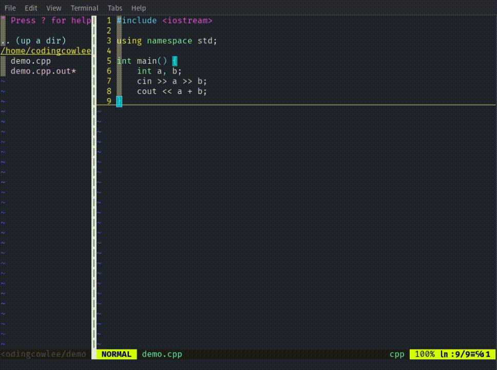
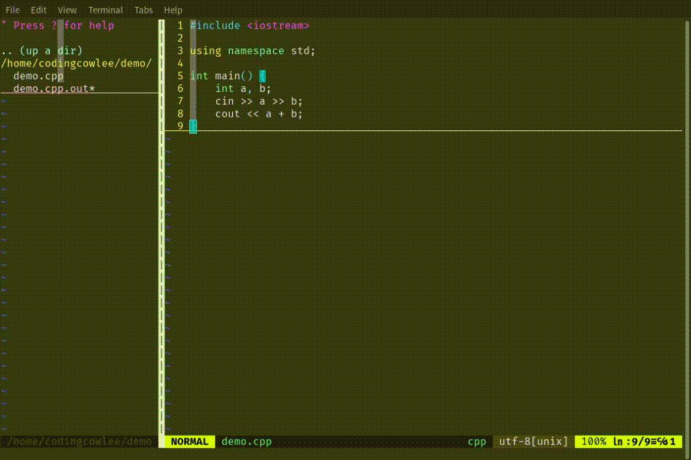

# VOIM - Vim OI Improve

[ENG](./README.md) | [中文](./README_zh.md)

This is a Vim plugin.

这是一个 VIM 插件。

Things you have to know: this plugin only support Unix-like Operating System.

一些您需要知道的问题：这个插件仅支持类 Unix 系统。

## Features

This plugin is designed to provide a more convenient Vim experience for OIers with the following features:

- One-click Compile and Run (implemented, currently supports C/C++ and Python)
- One-click Sample Testing (based on Competitive Companion, completed)
- One-click Compile and Debug (requires Insight support if you use default setting)

## Installation

Installing this plugin is very straightforward. Simply add it to your plugin list. The good news is that this plugin currently supports almost all plugin managers.

If you are using vim-plug, you can add the following to your `.vimrc`:

```vimrc
call plug#begin('~/.vim/plugged')
  Plug 'lixuannan/VOIM'
call plug#end()
```

Then, run the command `:PlugInstall` in Vim. To update the plugin, use the command `:PlugUpdate` in Vim.

Due to the plugin's specific nature, regardless of the plugin manager you use, you need to use the `:UpdateVOIM` command to update the necessary runtime components of VOIM along with the corresponding plugin manager's update command.

## Configuration

We define a command for one-click compile and run as `:RunCode`, and a command for one-click sample testing as `:JudgeCode`, and a command for one-click debug as `:DebugCode`. If you want to customize the shortcuts, you can add the following to your `.vimrc`:

```vimrc
" Set global shortcuts, where % represents the current file name
map <F5> :RunCode %<CR>
" Set insert mode shortcuts
imap <F5> <esc> :RunCode %<CR>
" Set visual mode shortcuts
vmap <F5> <esc> :RunCode %<CR>

map <F6> :JudgeCode %<CR>
imap <F6> <esc> :JudgeCode %<CR>
vmap <F6> <esc> :JudgeCode %<CR>

map <F7> :DebugCode %<CR>
imap <F7> <esc> :DebugCode %<CR>
vmap <F7> <esc> :DebugCode %<CR>
```

In the latest version of the plugin, we support custom compilers and compilation parameters. You can create a file `.VOIM.conf` in the user's `HOME` directory and write your configuration there. The following file shows the default configuration:

```cpp
# C compiler
C_COMPILER = "gcc"
# C++ compiler
CPP_COMPILER = "g++"
# Python interpreter
PYTHON_INTERPRETER = "python"
# C compilation options
C_ARGV = "-Wextra -g"
# C++ compilation options
CPP_ARGV = "-Wextra -g"
# Debugger command
DEBUGGER = "insight"
```

## Usage Help

If you receive the error `Unsupport filetype detected, run failed` but your code file extension is correct, please check if your cursor is on the file you need.

### One-click Compile and Run

If your file is correct, pressing the configured shortcut or entering the command `:RunCode /some/code/file.cpp` will automatically compile and run the program according to the configuration. It will usually output all compilation information, including warnings and errors. After compilation, the program will run automatically, and you can interact with your code as usual.

After the compilation and running, the plugin will output the return value of your code and the runtime for debugging purposes.



### One-click Sample Testing

This feature requires the Competitive Companion browser plugin. You can visit its [GitHub repository](https://github.com/jmerle/competitive-companion) or install it from the plugin application store.

When you need this feature, you can press the shortcut or enter the command `:JudgeCode /some/code/file.cpp`. If the plugin detects previously saved data files, it will directly test the code. If not, the program will prompt you to open the browser. At this point, you need to open the browser and click on the Competitive Companion plugin. The browser plugin will send the data to VOIM, which will then handle the data, compile, and test it.

After testing, the results may include:

- Accept, which means passed
- Time Limit Exceeded, which means time exceeded
- Runtime Error, which means runtime error
- Wrong Answer, which means incorrect answer

Note that this plugin does not support MLE (Memory Limit Exceeded) penalties. Additionally, TLE (Time Limit Exceeded) penalties are based on Real Time, not CPU Time. For debugging convenience, RE (Runtime Error) reports will provide return values and possible errors, but correctness is not guaranteed and is for reference only.



### One-click Compile and Debug

This feature requires the Insight software. You can search online for *how to install Insight debugger* to find installation instructions. Here are some common installation commands for various systems:

#### Arch Linux

```bash
yay -S insight
```

After installation, you only need to call `:DebugCode /some/code/file.cpp` or press your configured shortcut to compile and debug. You can search online for instructions on how to use Insight software.


### Clean Cache

You can use command `:CleanCache /some/code/file.cpp` to clean build cache and data.
