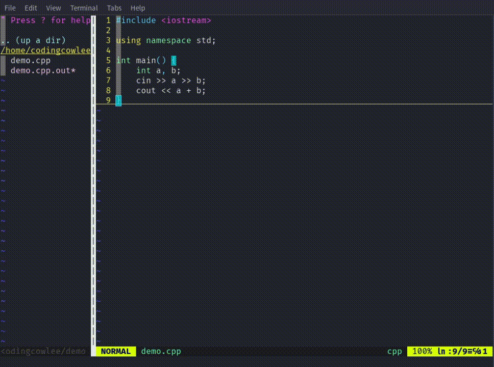
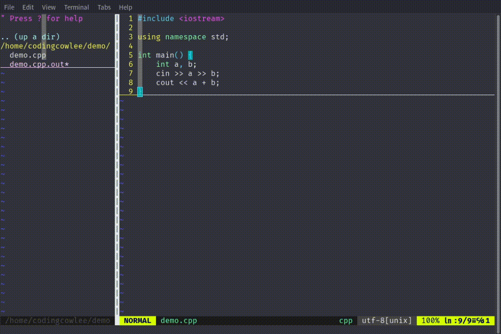
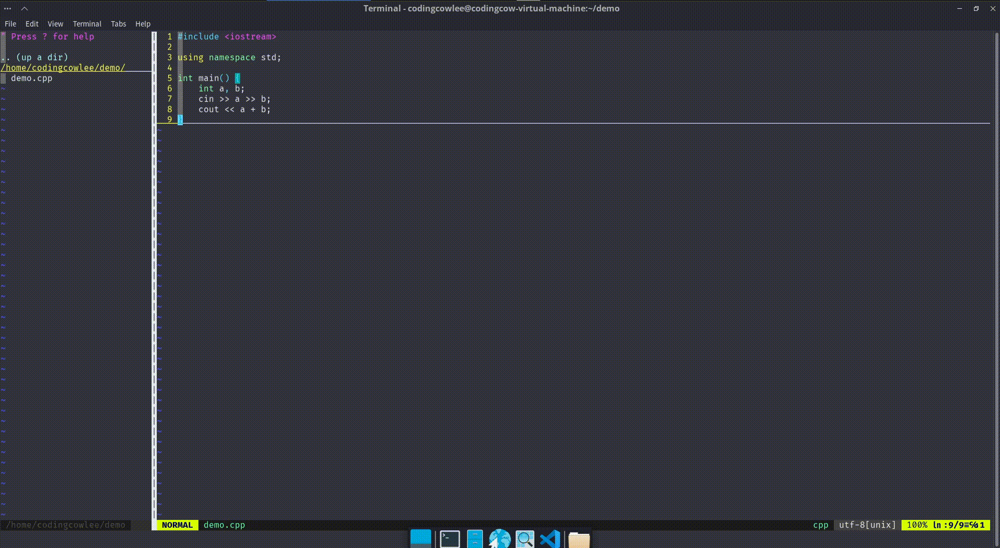

# VOIM - Vim OI Improve

[ENG](./README.md) | [中文](./README_zh.md)

This is a Vim plugin.

这是一个 VIM 插件。

## 功能

这个插件用于为 OIer 提供更方便的 VIM 使用体验，其功能如下：

- 一键编译运行（已实现，现支持 C/C++ 以及 Python）
- 一键评测样例（基于 Competitive Companion，已完成）
- 一键编译并调试（需要 Insight 的支持）

## 安装

使用这个插件是极其简单的，在插件列表中加入该插件即可。可喜可贺的是，这个插件目前已经支持了近乎所有的插件管理器。

如果你使用的是 vim-plug，你可以在 `.vimrc` 键入以下内容：

```vimrc
call plug#begin('~/.vim/plugged')
  Plug 'lixuannan/VOIM'
call plug#end()
```

然后在 vim 中输入命令 `:PlugInstall`。要更新插件，请在 vim 中输入命令 `:PlugUpdate`。

由于插件的特殊性，无论你使用的是什么插件管理器，你都需要在使用对应插件的更新命令的同时使用 `:UpdateVOIM` 命令来更新 VOIM 的必要运行组件。 

## 配置

我们定义了一个一键编译运行的命令 `:RunCode`，以及一键评测样例的命令 `:JudgeCode` 如果你要自定义快捷键，可以在 `.vimrc` 中这样写：

```vimrc
"设置全局的快捷键，其中 % 为当前文件的文件名
map <F5> :RunCode %<CR>
"设置插入模式的快捷键
imap <F5> <esc> :RunCode %<CR>
"设置选择模式的快捷键
vmap <F5> <esc> :RunCode %<CR>

map <F6> :JudgeCode %<CR>
imap <F6> <esc> :JudgeCode %<CR>
vmap <F6> <esc> :JudgeCode %<CR>

map <F7> :DebugCode %<CR>
imap <F7> <esc> :DebugCode %<CR>
vmap <F7> <esc> :DebugCode %<CR>
```

在最新版本的插件中，我们支持自定义编译器以及编译参数，你可以在用户的 `HOME` 目录中创建文件 `.VOIM.conf` 并写下配置。下面展示的文件为默认配置：

```cpp
# C 语言编译器
C_COMPILER = "gcc"
# C++ 编译器
CPP_COMPILER = "g++"
# Python 解释器
PYTHON_INTERPRETER = "python"
# C 编译选项
C_ARGV = "-Wextra -g"
# C++ 编译选项
CPP_ARGV = "-Wextra -g"
```

## 使用帮助

如果你得到报错 `Unsupport filetype detected, run failed` 但是你的代码后缀名没有问题，请你检查你的光标是否在你需要的文件上。

### 一键编译运行

如果你的文件没有问题，那么当你按下配置的快捷键或者输入命令 `:RunCode /some/code/file.cpp` 的时候程序就会自动的根据配置进行编译，然后运行。通常来说会输出编译的所有信息，包括警告、报错等等。编译完成后，程序会自动运行，你只需要正常的与你的代码交互即可。

编译运行结束后，插件会输出你的代码的返回值，以及运行时长以方便调试。



### 一键评测样例

这个功能需要浏览器插件 Competitive Companion 的支持，你可以前往他的 [Github 仓库](https://github.com/jmerle/competitive-companion)或者在插件应用商店安装。

当你需要这个功能的时候，你可以按下快捷键或者输入命令 `:JudgeCode /some/code/file.cpp`，如果插件检测到了之前保存的数据文件，那么就会直接评测，如果没有，程序会提示你需要打开浏览器，这时你就需要打开浏览器，然后左键单击 Competitive Companion 插件。此时浏览器插件就会将数据发送到 VOIM，然后 VOIM 就会处理数据，编译并评测。

评测后将有可能返回以下结果：

- Accept，即通过
- Time Limite Exceeded，时间超限
- Runtime Error，运行时错误
- Wrong Answer，答案错误

需要特别指出的是，本插件并不支持 MLE，即内存超限的判罚。同时 TLE 的判罚是基于 Real Time 而不是 CPU Time 的。为了方便各位调试，RE 的报错会提供返回值以及其对应的可能错误，但是不保证对应正确，仅供参考。



### 一键编译调试

这个功能需要 Insight 软件，你可以在网上搜索 *如何安装 Insight 调试器* 来查询如何安装。下面可以提供一些常见系统的安装命令：

#### Arch Linux

```bash
sudo pacman -S insight
```

#### Ubuntu / Debian

```bash
sudo apt install insight
```

安装后你只需要调用 `:DebugCode /some/code/file.cpp` 或者按下你所设置的快捷键来进行编译并调试。关于 Insight 软件的使用方法，可以自行上网查找。


